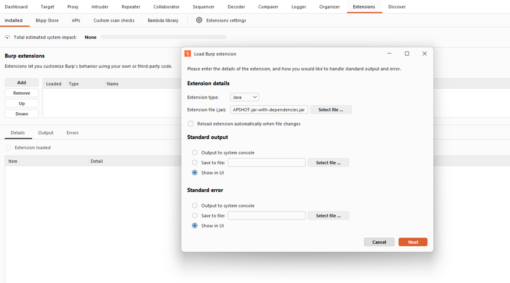
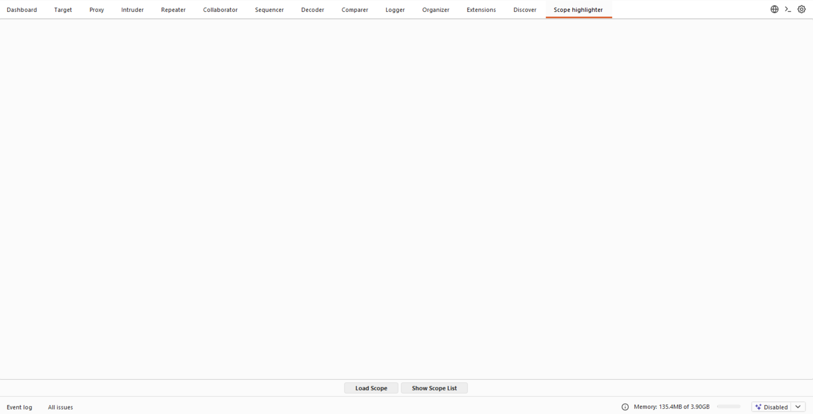
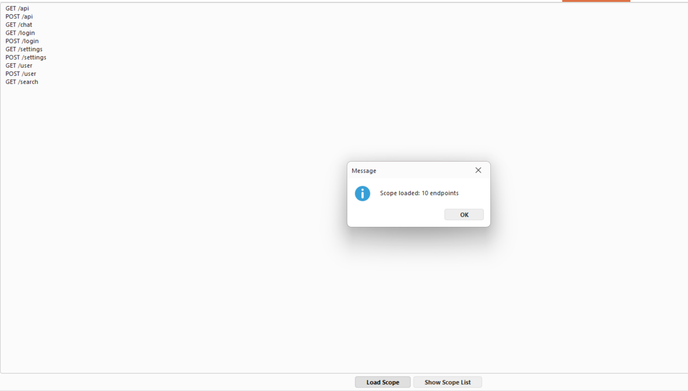
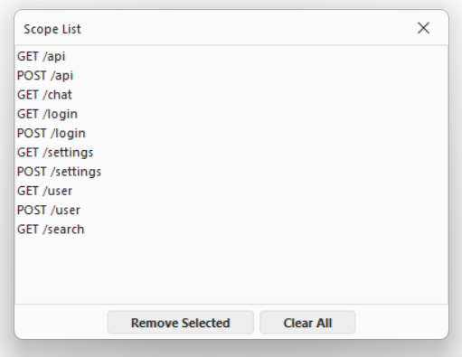
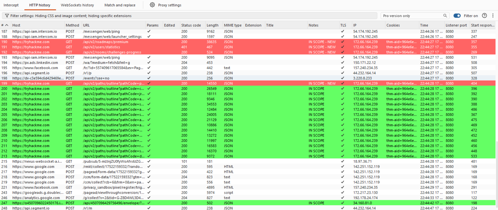
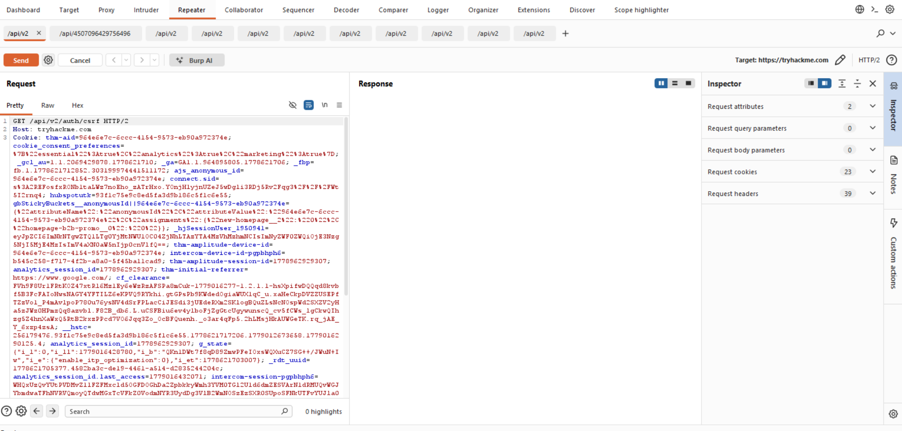

## What is Scope Highlighter?
Scope Highlighter is a Burp Suite extension for highlighting all the endpoints that are in the scope. 
If the endpoint appeared for the first time it will be highlighted in red and sent to the Repeater. The Repeater 
shows all of the first appeared endpoints in tabs that are named after the endpoint. If an endpoint is in the scope and
it is not the first time to appear then it will be highlighted green. The **Scope Highlighter** tab is one big text area
that allows entering a list of endpoints, this tab also has two buttons - **Load Scope** and **Show Scope List**.
Load scope adds the endpoint from text area to the list of scopes and the second button opens a pop-up with the list of all endpoints.
In the pop-up with the list we can modify list by deleting all endpoints or deleting only the selected one.

## Installation
Open **Extension** tab in Burp Suite and click on **Add** for adding new extension. Then select the .jar file 
from the ScopeHighlighter/target/ directory (ScopeHighlighter-1.0-SNAPSHOT-jar-with-dependencies.jar) and add it to a Burp Suite.
Once it is added you should see the new tab **Scope Highlighter**.

## How to Use
The Scope Highlighter has main text area that can receive a list of endpoints and HTTP methods that we want to 
add to a list, when all endpoints are listed in text area we can click on **Load scope** button to add the endpoints on the list.
Once it is added the pop-up will show how many endpoints we currently have. The second button - **Show scope list** 
will open a dialog with list of all the endpoints that are currently in list, it also contains two buttons, **Remove selected**
and **Clear all** for deleting a selected endpoint or for deleting all of them. 

When we create the list of all the endpoints that we want to track we can go to Proxy and start intercepting traffic.
If the proxy finds an endpoint that is in the list it will be highlighted in green, if that endpoint never appeared it will be
highlighted in red. The red endpoints are transferred to the Repeater. Each endpoint is sent to the Repeater only once and gets its own tab named after the endpoint path,
making it easy to test and modify requests for each in-scope endpoint individually.

## Screenshots
1. First step is to add an extension

2. Once added, the Scope Highlighter tab will appear

3. After clicking Load Scope, a pop-up confirms how many endpoints were added

4. Show Scope List dialog displaying all currently added endpoints

5.  HTTP History showing highlighted endpoints - red for first appearance, green for repeated

6. Repeater tabs automatically created and named after each new in-scope endpoint

## Notes
- Endpoints are saved between Burp sessions
- Endpoint format: `METHOD /path` (e.g. `GET /api/v1/user`, `POST /api/v1/login`)
- Prefix matching is used, so `/api/` will match all `/api/v2/...` endpoints
- Duplicate endpoints are automatically ignored